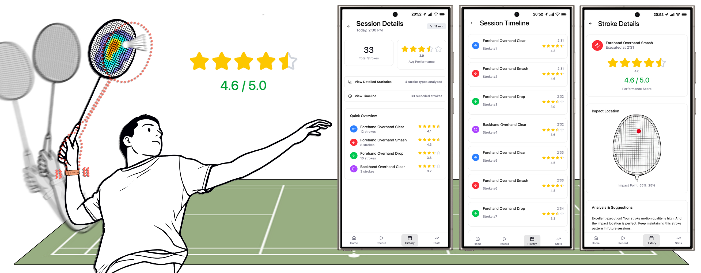
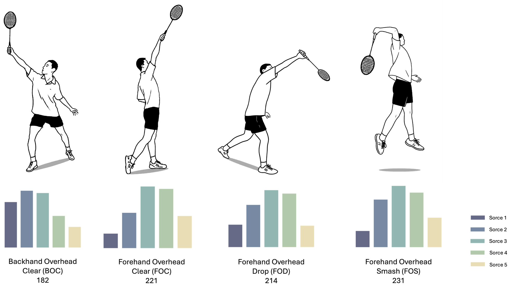

# BadminSense_Dataset [ English | [简体中文](/README.zh_CN.md) ]

This repository contains the dataset constructed for the paper 《[BadminSense: Enabling Fine-Grained Badminton Stroke Evaluation on a Single Smartwatch]()》. Our work enables the capture of human badminton motion data using a single smartwatch, supporting both real-time fine-grained motion analysis and long-term performance tracking with statistical metrics.



## Licenses
<a rel="license" href="https://creativecommons.org/licenses/by-nc-nd/4.0/"></a><br />

This work is licensed under a <a rel="license" href="https://creativecommons.org/licenses/by-nc-nd/4.0/">Creative Commons Attribution-NonCommercial-NoDerivatives 4.0 International License</a>.

All materials are published under the [Creative Commons BY-NC-ND 4.0](https://creativecommons.org/licenses/by-nc-nd/4.0/legalcode) license. You can download, use, and share these materials for **non-commercial purposes**, as long as you give appropriate credit by **citing our paper** and **do not modify or use them for commercial purposes in any way**.

## BADS_CLL Dataset

BadminSense constructed a badminton dataset named BADS_CLL, featuring four commonly used stroke types with corresponding labels, manually annotated racket contact impact location, and stroke quality rating for each shot delivered by experienced badminton players.



### Download

You can download the dataset (14 GB, Version 1.0) from Google Drive [[BADS_CLL_OPENACCESS_V1](https://drive.google.com/file/d/10Jp0-fqgbI4Gg4-hmDnopFc3JdQNQOnc/view?usp=sharing)]. The BADS_CLL dataset contains 848 valid stroke samples, each providing sensor (IMU + Audio) stroke data, stroke video clips, player information, and three data labels: `Stroke Type`, `Stroke Quality Rating`, and `Impact Location`.

### Data Format and Description

> Overall Format

After unzipping the downloaded `.zip` file, you will obtain the BADS_CLL dataset consisting of 96 folders. Each folder corresponds to one Player, one `Stroke Type`, and one `Section`, containing data for up to 10 valid stroke.

Additionally, the folder name RecordName encodes specific information in the format `Gender_Exp_StrokeType_PlayerCode_Section_Device`. This allows you to quickly grasp the general details of the `Section` simply by examining the folder name.

> Section Format

Upon opening a folder, which represents a `Section`, you will find a `.json` file containing up to 10 valid stroke action entries, each paired with its corresponding stroke action `.gif` file.

For a valid stroke action, the data primarily consists of `Info`, `Label`, `Data`, and `Gif`, with the following details:

* `Info`

|Field|Description|
|-|-|
|recordName|Same as the folder name|
|gender|Player's gender (Male, Female)|
|exp|Player's badminton experience level (Low, Medium, High)|
|section|The (1st, 2nd) `Section` of this `Stroke Type`|
|startTimestamp|The start timestamp of this batting action|
|endTimestamp|The end timestamp of this batting action|

* `Label`

|Field|Description|
|-|-|
|positionX|`Impact Location` x coordinate [-0.5, 0.5]|
|positionY|`Impact Location` y coordinate [0, 1]|
|actionType|`Stroke Type`|
|actionEval|`Stroke Quality Rating` provided by 7 experienced players|

The correspondence between dataset stroke type and paper stroke type is as follows:

|Dataset|Paper|
|:-:|:-:|
|BackhandTransition|BOC|
|ForehandHigh|FOC|
|ForehandLob|FOD|
|ForehandKill|FOS|

* `Data`

|Field|Description|
|-|-|
|ACCELEROMETER|Accelerometer xyz sensor data and timestamp|
|AUDIO|Microphone sensor data and timestamp|
|GYROSCOPE|Gyroscope xyz sensor data and timestamp|
|GYROSCOPE_UNCALIBRATED|Gyroscope uncalibrated sensor xyz data，Drift，and timestamp|
|MAGNETIC_FIELD|Magnetometer sensor xyz Data and timestamp|
|MAGNETIC_FIELD_UNCALIBRATED|Magnetometer uncalibrated sensor xyz Data，Bias，and timestamp|
|ROTATION_VECTOR|Rotation vector xyz Data，cos delta, heading accuracy, and timestamp|

The IMU data sampling rate is 100Hz, while the microphone data sampling rate is 16000Hz.

* `Gif`

The naming format for `.gif` files is `recordName@Index.gif`, where `Index` represents the sequential order of the corresponding stroke action data within the `.json` file, starting from 0.

## Citation

If you find our materials or paper useful, please consider citing:

```latex

```